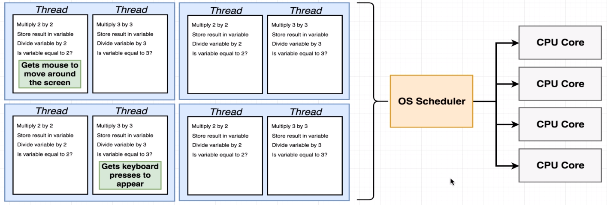
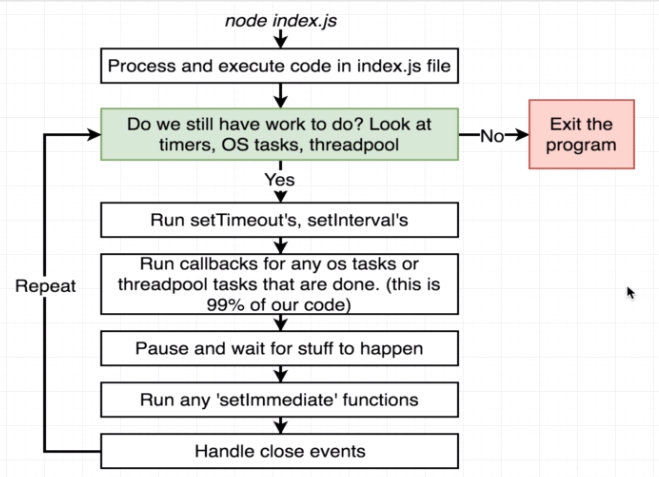

# nodejs-sandbox

Repositório destinado à estudar, documentar e aplicar conceitos sobre qualquer conteúdo relacionado à Node.js e JavaScript;

## O que é Node.js

É uma plataforma para execução de JavaScript que utiliza o conceito baseado em eventos (_event driven_) e um modelo de I/O não bloqueante.

O design baseado em eventos assíncronos facilita o desenvolvido aplicações que utilizam rede de forma bastante escalável, podendo lidar com inúmeras conexões concorrentese e diferente do modelo tradicional de rede baseado em threads, o que pode ser ineficiente e difícil de utilizar.

### Características

- É baseado na Engine de JavaScript V8 do Chrome.
- I/O assíncrono e baseado em eventos, não bloqueando a execução da aplicação.
- Utiliza um modelo de single thread baseado no event looping.
- É facilmente escalável devido ao mecanismo baseado em eventos.
- Não consome muito tempo de processamento por _"buffering"_  de arquivos pois estes são separados em pedaços (_chunks_)
- É open-source, permitindo que exista uma comunidade bastante ativa fornecendo excelentes módulos e capacidades adicionais às aplicações.
- É disponibilizado sobre a licença MIT.

### Gerenciamento de pacotes

**[NPM](https://docs.npmjs.com/about-npm/) (Node Package Manager)**: é uma CLI e um registry para gerênciamento de pacotes do Node.js

### Principais Pilares

- [V8 - JavaScript/WebAssembly Engine](https://v8.dev/) é uma engine de alta performance escrita em C++, utilizada no navegador Google Chrome, no Node.js, entre outros.
- [libuv](https://libuv.org/) é uma biblioteca multiplataforma focada em I/O assíncrono, primáriamente desenvolvida para o Node.js, mas também utilizada em outras linguagens.

### Que tipo de cenário é recomendado utilizar?

- Aplicações baseadas em I/O
- Aplicações com streaming de dados
- _Data Intensive Real-time Applications (DIRT)_
- JSON APIs
- SPA's

## Conceitos

**Task queue (delayed tasks)**: fila de instruções à serem executadas, são geralmente funções de _callbacks_ utilizadas em alguma das APIs do Node.js (I/O, promises, etc) ou Web APIs (DOM manipulation, etc).

- **Macro tasks**: categoriza tarefas que devem ser processada em um ciclo do Event Loop. _Exemplos: setTimeout, I/O e setInterval_
  
- **Micro tasks**: categoriza tarefas que devem ser executadas rapidamente, fazendo com que após o Event Loop processar uma **Macro task**, todas as **Micro tasks** disponíveis na **Task queue** sejam processadas (enviadas para a callstack) antes da próxima **Macro task** da fila, independente da posição em que as **Micro tasks** estavam. _Exemplos: Promises e process.nextTick_

- Mais em _[Tasks, microtasks, queues and schedules por Jake Archibald](https://jakearchibald.com/2015/tasks-microtasks-queues-and-schedules/)_

**Call stack (execution contexts)**: pilha de instruções que serão executadas para uma determinada chamada no contexto de execução.

**Event loop (task scheduler)**: é responsável por verificar se há callbacks aguardando na **Task queue** que podem ser levadas para **call stack** para serem executadas.

**Worker pool (background-tasks - multithreaded)**: é onde são executadas instruções de APIs como I/O assíncrono do Node.js (através do libuv) onde a leitura de um arquivo ou a escuta de um socket é processada até que seu callback possa ser enviado para a **Task queue**, ou quando a API do _setTimeout_ está contando regressivamente o timer para enviar o _callback_ para a **Task queue**.

**Heap (memory available)**: é o recurso à nível de hardware (memória) disponível para armazenar valores de objetos, strings, etc. São automaticamente liberados quando não são mais utilizados, e esse processo é identificado através do _garbage collection_, que utiliza o conceito de contagem por referências para identificar quando é possível liberar recursos alocados para este determinado espaço da memória. Esses recursos são gerênciados pela engine V8.

**REPL ou Read-Eval-Print-Loop**: interface de linha de comando para executar códigos JavaScript, é considerado um "console interativo", semelhante encontrado nos DevTools dos navegadores.

## Node.js Internals

Como funciona o Node.js internamente? Qual seu relacionamento com o C++?

> **Repositório Node.js no GitHub [https://github.com/nodejs/node](https://github.com/nodejs/node)**

- _`lib/internal`_ contém todas as implementações de funções e módulos disponíveis do lado "JavaScript" do Node.js  
- _`src`_ contém todas as implementações em C++ das funções, é onde estão alocados as implementações utilizando libuv, v8, etc.

### Ponte entre JavaScript and C++

- `process.binding()` é o método que conecta métodos JavaScript e C++, servindo como ponte  
- `v8` é utilizado para traduzir as estrutura de dados do JavaScript para os equivalentes em C++

## Threads

Quando iniciamos um programa em nosso computador, nós iniciamos um `processo`, sendo este uma instância de um programa de computador que está sendo executado.

Para cada `processo` podemos ter múltiplas `threads`, que por sua vez, pode ser interpretado como uma _lista de tarefas a fazer_, contendo uma sequência de instruções que deve ser processada pela CPU do computador, começando pelo topo, indo até o fim.

Existe um componente responsável por definir qual `thread` deve ser processada pela CPU em um determinado momento do tempo, chamado de `OS Scheduler`, gerência os recursos disponíveis para cada dispositivo.

Importante: **urgent threads** não devem esperar muito tempo para serem executadas. Ex: Thread com ação de mover o mouse na tela, travar, seria algo ruim à experiência do usuário.

Existe algumas diferentes estratégias para aprimorar a taxa de processamento das threads, no mundo do NodeJS há duas que são bastante comum.

1. Adicionar mais **CPU Core** à maquina, permitindo que mais threads sejam processadas ao mesmo tempo por núcleos diferentes. _(Obs: supondo que cada core, processa uma thread por vez, existem tecnologias que permitem mais de uma thread seja processada ao mesmo tempo, com conceitos de `multithreading` ou `hyperthreading`)_

2. Permitir que o `OS Scheduler` detecte grandes pausas de processamento devido ao uso de `I/O`, permitindo então que `threads` com instruções de `I/O` em andamento sejam colocadas em `pause` e que o fluxo de processamento seja redirecionado à uma outra `thread` até que o `I/O` seja finalizado para uma futura continuação.

### Node Event Loop

Toda vez que um **processo do NodeJS** é iniciado é criado automaticamente uma única `thread`, a qual possui um componente chamado `event loop`, que pode ser considerado uma estrutura de controle, que decide o que esta `thread` deve estar fazendo em um determinado momento do tempo.

Um `pseudo-codigo` do **Event Loop** foi implementado à fim de entender seu funcionamento. [Visualizar](concepts/event-loop/eventloop.js).

### Is Node Single Threaded?

Na verdade não, o **Event Loop** é single thread, assim como visto acima, quando iniciamos um processo do Node, uma única thread é criada com o event loop, o que pode ser ruim quando possuirmos múltiplos CPU cores disponívels o Node não irá utilizá-los **automaticamente**.

Algumas funções incluídas nos **Core Modules** do Node **não são single threaded!**, são executadas fora do event loop, fora da single thread do event loop.

Um exemplo prático da prova deste conceito foi implementado. [Visualizar](concepts/event-loop/threads.js)

#### Libuv Thread Pool

Como no exemplo acima, a função `pbkdf2` do módulo `crypto` delega seu processamento ao `C++` do Node.js que é realizado através do `libuv`.

`libuv` é responsável pela execução de algumas das funções disponíveis dentro dos **core modules** do Node.js. Possui um **thread pool** que é responsável por **CPU Intensive Tasks**, como por exemplo a `pbkdf2`.

Por padrão, o `libuv` cria 4 threads neste Thread Pool, o que significa, que adicionalmente à thread o event loop, temos 4 outras threads para delegar tarefas pesadas.

> É possível utilizar o **thread pool** para funções que escrevemos ou somente funções padrões do Node.js podem utilizar? _**Resposta:** Sim, é possível escrever funções JavaScript que utilizam o thread pool._

> Quais funções dos **core modules** que utilizam o **thread pool**? **Resposta:** Depende do sistem/a operacional (windows vs unix), mas todas as funções do `fs` e algumas do `crypto`

> Onde estão estas funções do threadpool no pseudo-código do event loop? **Resposta:** São consideradas como _pendingOperations_

Curiosidade sobre o `readFile`, o qual faz duas viagens, uma inicial para identificar estatísticas do arquivo e outra para buscar o conteúdo.

#### Libuv OS Delegation

Libuv não tem capacidade de lidar com operações tão `low-level` como por exemplo transmissão de dados através da rede, diretamente. Esses tipos de tarefas são delegadas ao sistema operacional, e o libuv aguarda por sinais emitidos identificando a finalização da tarefa, ou seja, são assíncronos, não bloqueando o funcionamento da aplicação em Node.js.

Exemplo implementado. [Visualizar](concepts/event-loop/async.js)

> Quais funções dos **core modules** que utilizem recursos do sistema operacional de forma assíncrona? **Resposta:** Quase tudo que envolve networking (rede) para todos os OS's e algumas outras são específicas de cada OS.

> Onde estão estas funções assíncronas no pseudo-código do event loop? **Resposta:** São consideradas _pendingOSTasks__

## Enhancing Performance

Iremos analisar duas das principais formas de melhorar a performance de aplicações em Node.js. [Implementações](concepts/enhancing-performance)

1. Executar o Node em **Cluster Mode**, ganhando assim, múltiplas instâncias do **event loop** e **thread pool**, tornando o Node, meio que "multi-thread". **Este método é recomendado.**. [Visualizar exemplo de implementação manual](/concepts/enhancing-performance/express-cluster.js), [Visualizar PM2 - Cluster Management Tool for Production](http://pm2.keymetrics.io/docs/usage/quick-start/)

2. Usar **Worker Threads**, spawnando threads separadas para processar instruções. **Este método está em fase experimental**. Vale a pena ressaltar que para os exemplos em que foi utlizado o método de hash para simular calculos pesados, em worker threads não terão difereça, visto que a função `pbkdf2` roda no thread pool do libuv. [WebWorker Threads @ Docs](https://www.npmjs.com/package/webworker-threads). É aconselhável utilizar esta abordagem em cenários onde exista instruções pesadas específica do negócio para rodar fora do event-loop (Exemplos encontrados: cálculo de numeros primos, fibonacci, etc).

## Core Modules

São módulos nativos, embutidos no Node.js, não sendo necessária a instalação.

- [`util`](https://nodejs.org/api/util.html) módulo nativo com inúmeros métodos utilitários, um exemplo é o promisify, que retorna uma promise da função desejada;
- [`libuv`](https://github.com/libuv/libuv) biblioteca multi-plataforma responsável pela realização de I/O assíncrono, fornecendo implementação do event loop e do thread pool, juntamento com o suporte a TCP e UDP socket, resolução de DNS, sistema de arquivos, processos, entre outras, implementada em C++;
- `crypto` fornece funcionalidade criptográfica que inclui um conjunto de invólucros para as funções hash, HMAC, cipher, decipher, sign, e verify do OpenSSL.
- [`cluster`](https://nodejs.org/api/cluster.html) módulo nativo utilizado para tomar vantagem de sistemas multi-core servindo com gerênciador de instâncias de processos.

## Community Modules

São módulos implementados e distribuídos pela comunidade através do NPM (Node Package Manager).

- [`nodemon`](https://github.com/remy/nodemon#nodemon) ferramenta de restart de processos em caso de alterações de arquivos
- [`artillery`](https://github.com/artilleryio/artillery) ferramenta completa para testes de APIs, testes de cargas, testes funcionais, etc.
- [`pm2`](http://pm2.keymetrics.io/docs/usage/quick-start/) ferramenta para gerenciamento de processos, clusterização, deployments, etc.
- [`mongodb`](https://github.com/mongodb/node-mongodb-native) driver de interação com banco de dados MongoDB;
- [`jsonwebtoken`](https://github.com/auth0/node-jsonwebtoken) é uma implementação da RFC-7519 (JSON Web Token) utilizada para encodar, assinar, etc estruturas de dados JSON de forma digital e segura.
- [`Express`](https://expressjs.com/pt-br/4x/api.html#express) framework web, rápido, flexível e minimalista
  - [`express-validator`](https://express-validator.github.io/docs/) middleware para validações de parâmetros em requests
  - [`express-session`](https://github.com/expressjs/session) middleware para criação e controle de sessions utilizando cookies
  - [`body-parser`](https://www.npmjs.com/package/body-parser) middleware para fazer o parse do body das requests
- [`Nest.js`](https://docs.nestjs.com/) framework para construção de aplicações server-side eficientes, confiáveis e escalaveis
- [`EJS`](http://ejs.co/) permite construção de templates dinâmicos com uma sintáxe própria.
- [`handlebars`](https://handlebarsjs.com/) permite construção de HTMLs com expressões customizadas, sintáxe de expressões parecida com a do Angular.js 1.x.
- [`pug`](https://pugjs.org/api/reference.html) permite construção de HTMLs minimalistas, sem tags de fechamentos, com identação estilo `.yaml` para definir blocos de tags.
- [`Hapi`](https://hapijs.com/api) é um framework para construção de aplicações e API's, com bastante foco na configuração e reuso.
  - [`@hapi/joi`](https://www.npmjs.com/package/@hapi/joi) permite criação de validações
- [`validator.js`](https://github.com/chriso/validator.js) utilitário com inúmeros métodos de validações em JavaScript (é dependência do express-validator) - [`nodemailer`](https://nodemailer.com/about/) criação e envio de e-mails
- [`Qs`](https://github.com/ljharb/qs) é um parser de querystring
- [`Sequelize`](http://docs.sequelizejs.com/) promise-based object-relational mapping (ORM) c/ suporte para PostgreSQL, MySQL, etc, suporta inúmeras características de bancos relacionais.
- [`Mongoose`](https://mongoosejs.com/docs/index.html) MongoDB object modeling, com suporte à validação, queries, hooks, etc.
- [`Knex.js`](https://knexjs.org/) é um utilitário para criação de queries para Postgres, MySQL, Oracle, etc, com o objetivo de ser flexível, portável e fácil, suporta inúmeras características de bancos relacionais.
- [`async`](https://caolan.github.io/async/docs.html) módulo com vários métodos para o uso em trabalhos assíncronos com JavaScript.
- [`consign`](https://www.npmjs.com/package/consign) utilitário usado para requerir automaticamente todos os arquivos de um determinado diretório
- [`connect-flash`](https://github.com/jaredhanson/connect-flash) utilitário para troca de mensagens através de cookies em requests.
- [`connect-mongodb-session`](https://github.com/mongodb-js/connect-mongodb-session) utilitário para armazenamento de sessões no MongoDB com o módulo Express.
- [`bcrypt.js`](https://github.com/dcodeIO/bcrypt.js/blob/master/README.md) documentação oficial do bcrypt.js
- [`Multer`](https://github.com/expressjs/multer) middleware para express para lidar com _multipart/form-data_ que é utilizado principalmente para upload de arquivos.
- [`PDFKit`](http://pdfkit.org/) ferramenta para criação de PDFs dentro do Node.js.
- [`Morgan`](https://github.com/expressjs/morgan) http request logger middleware.
- [`socket.io`](https://socket.io/docs/) biblioteca que permite comunicação realtime utilizando websockets.
- [`express-ws`](https://www.npmjs.com/package/express-ws) websockets para aplicações com servidor http com express.
- [`helmet`](https://github.com/helmetjs/helmet) middleware p/ express que adiciona varios http headers para previnir alguns attacks conhecidos;
- [`compression`](https://github.com/expressjs/compression) middleware para express para habilitar compression (gzip/deflate) de recursos;
- [`Jest`](https://jestjs.io/docs/en/getting-started) framework JavaScript para implementação de testes.
- [`mocha`](https://mochajs.org/) framework para nodejs e browser para implementaçõa de testes unitários;
- [`chai`](https://www.chaijs.com/) biblioteca de asserção para nodejs e browser;
- [`Sinon.JS`](https://sinonjs.org/) biblioteca para mocks, stubs, spies em testes;
- [`Puppeteer`](https://github.com/GoogleChrome/puppeteer) biblioteca que provê uma API de controle do chrome/chromium de forma headless ou non-headless. Muito utilizada em automações de testes, geração de PDFs/screenshots, testes de extensões do chrome, etc.
- [`node-config`](https://github.com/lorenwest/node-config) permite facilmente configurar parâmetros de deployments por environment (development, staging, production, etc)
- [`dovenv`](https://github.com/motdotla/dotenv) permite carregar environment variables através de um arquivo `.env` para o `process.env`
- [`sucrase`](https://github.com/alangpierce/sucrase) alternativa ao Babel para compilação de TypeScript, Flow, JSX, imports -> JavaScript, muito mais veloz para ambientes de desenvolvimento.
- [`TypeScript`](https://github.com/Microsoft/TypeScript) "superset" of JavaScript, conjunto de extra-features ao JavaScript, principalmente, tipagem estática.
- [`gm`](https://github.com/aheckmann/gm) [GraphicsMagick and ImageMagick para Node.js](http://www.graphicsmagick.org/) - utilitário para manipulação de imagens
- [`Jimp`](https://www.npmjs.com/package/jimp) biblioteca para manipulação de imagens, sem dependências igual ao gm acima.
- [`Standard`](https://github.com/standard/standard) ferramenta para padronização de escrita de código JavaScript (code-linting) e possui automatizador para correção automática.
- [`SendGrid`](https://sendgrid.com/docs/) biblioteca para integração com o serviço de e-mail em cloud provido ppela SendGrid.
- [`stripe`](https://stripe.com/docs) biblioteca para integração com o gateway de pagamento do Stripe.

## Docs

- [Official Node.js Guides](https://nodejs.org/en/docs/guides/)
- [Official Node.js Documentation](https://nodejs.org/dist/latest/docs/api/)
- [Official MongoDB Documentation](https://docs.mongodb.com/manual/)
- [CommonJS Specification](http://wiki.commonjs.org/wiki/CommonJS)
- [Node.js @ GitHub](https://github.com/nodejs/node)

## References

- [Node.js - Event Loop](https://nodejs.org/en/docs/guides/event-loop-timers-and-nexttick/)
- [Node.js - Blocking Code & Non-Blocking Code](https://nodejs.org/en/docs/guides/dont-block-the-event-loop/)
- [Loupe - Site interativo para entender callstack, event loop, APIs e callback queue](http://latentflip.com/loupe)
- [Anatomy of a Modern Node.js Application Architecture](https://kapost-files-prod.s3.amazonaws.com/published/54ecac5ad433c3a69100035b/infographic-anatomy-of-a-modern-node-dot-js-application-architecture.pdf)
- [Tasks, microtasks, queues and schedules](https://jakearchibald.com/2015/tasks-microtasks-queues-and-schedules/)
- [MVC - Modern Web App Architecture @ MDN](https://developer.mozilla.org/en-US/docs/Web/Apps/Fundamentals/Modern_web_app_architecture/MVC_architecture)
- [Holding on to your Performance Promises - Maya Lekova and Benedikt Meurer](https://www.youtube.com/watch?v=DFP5DKDQfOc&)
- [The Strict Mode of ECMAScript](http://www.ecma-international.org/ecma-262/5.1/#sec-C)
- [ES6 Generators estão mudando nosso modo de escrever JavaScript](https://medium.com/nossa-coletividad/es6-generators-est%C3%A3o-mudando-nosso-modo-de-escrever-javascript-e99f7c79bdd7)
- [CSRF Attacks, XSRF or Sea-Surf](https://www.acunetix.com/websitesecurity/csrf-attacks/)
- [Node.js Streams - Everything you need to know](https://medium.freecodecamp.org/node-js-streams-everything-you-need-to-know-c9141306be93)
- [Node.js Detailed Approach Logging](https://blog.risingstack.com/node-js-logging-tutorial/)
- [TypeScript - Vantagens, Mitos e Conceitos @ RocketSeat](https://blog.rocketseat.com.br/typescript-vantagens-mitos-conceitos)
- [Node.js API Gateway vs API Manager @ Luiz Tools](https://www.luiztools.com.br/post/api-gateway-em-arquitetura-de-microservices-com-node-js/)
- [NodeJS - The Complete Guide - Maximilian Schwarzmuller @ Udemy](https://www.udemy.com/nodejs-the-complete-guide/)
- [Advanced Node.js for Developers - Stephen Grider @ Udemy](https://www.udemy.com/advanced-node-for-developers)
- [Node.js Playlist - Rodrigo Branas @ Youtube](https://youtu.be/KtDwdoxQL4A?list=PLQCmSnNFVYnTFo60Bt972f8HA4Td7WKwq)
- [Pagar.me - Talks @ Youtube](https://www.youtube.com/channel/UCNhSCufrcOMeFvzEM7tt9Lw)
