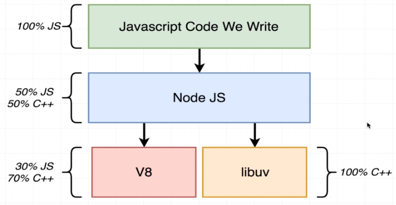
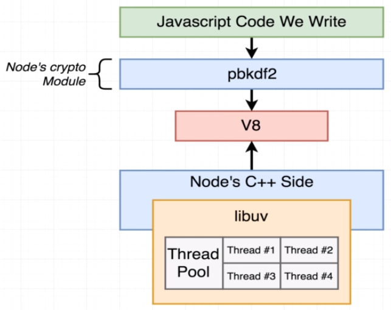

# Conceitos Avançados de Node.js

**Task queue (delayed tasks)**: fila de instruções à serem executadas, são geralmente funções de _callbacks_ utilizadas em alguma das APIs do Node.js (I/O, promises, etc) ou Web APIs (DOM manipulation, etc).

- **Macro tasks**: categoriza tarefas que devem ser processada em um ciclo do Event Loop. _Exemplos: setTimeout, I/O e setInterval_

- **Micro tasks**: categoriza tarefas que devem ser executadas rapidamente, fazendo com que após o Event Loop processar uma **Macro task**, todas as **Micro tasks** disponíveis na **Task queue** sejam processadas (enviadas para a callstack) antes da próxima **Macro task** da fila, independente da posição em que as **Micro tasks** estavam. _Exemplos: Promises e process.nextTick_

- Mais em _[Tasks, microtasks, queues and schedules por Jake Archibald](https://jakearchibald.com/2015/tasks-microtasks-queues-and-schedules/)_

**Call stack (execution contexts)**: pilha de instruções que serão executadas para uma determinada chamada no contexto de execução.

**Event loop (task scheduler)**: é responsável por verificar se há callbacks aguardando na **Task queue** que podem ser levadas para **call stack** para serem executadas.

**Worker pool (background-tasks - multithreaded)**: é onde são executadas instruções de APIs como I/O assíncrono do Node.js (através do libuv) onde a leitura de um arquivo ou a escuta de um socket é processada até que seu callback possa ser enviado para a **Task queue**, ou quando a API do _setTimeout_ está contando regressivamente o timer para enviar o _callback_ para a **Task queue**.

**Heap (memory available)**: é o recurso à nível de hardware (memória) disponível para armazenar valores de objetos, strings, etc. São automaticamente liberados quando não são mais utilizados, e esse processo é identificado através do _garbage collection_, que utiliza o conceito de contagem por referências para identificar quando é possível liberar recursos alocados para este determinado espaço da memória. Esses recursos são gerênciados pela engine V8.

**REPL ou Read-Eval-Print-Loop**: interface de linha de comando para executar códigos JavaScript, é considerado um "console interativo", semelhante encontrado nos DevTools dos navegadores.

## Node.js Internals

Como funciona o Node.js internamente? Qual seu relacionamento com o C++?

> **Repositório Node.js no GitHub [https://github.com/nodejs/node](https://github.com/nodejs/node)**

- _`lib/internal`_ contém todas as implementações de funções e módulos disponíveis do lado "JavaScript" do Node.js
- _`src`_ contém todas as implementações em C++ das funções, é onde estão alocados as implementações utilizando libuv, v8, etc.

### Ponte entre JavaScript and C++

- `process.binding()` é o método que conecta métodos JavaScript e C++, servindo como ponte
- `v8` é utilizado para traduzir as estrutura de dados do JavaScript para os equivalentes em C++

### Threads

Quando iniciamos um programa em nosso computador, nós iniciamos um `processo`, sendo este uma instância de um programa de computador que está sendo executado.

Para cada `processo` podemos ter múltiplas `threads`, que por sua vez, pode ser interpretado como uma _lista de tarefas a fazer_, contendo uma sequência de instruções que deve ser processada pela CPU do computador, começando pelo topo, indo até o fim.

Existe um componente responsável por definir qual `thread` deve ser processada pela CPU em um determinado momento do tempo, chamado de `OS Scheduler`, gerência os recursos disponíveis para cada dispositivo.

Importante: **urgent threads** não devem esperar muito tempo para serem executadas. Ex: Thread com ação de mover o mouse na tela, travar, seria algo ruim à experiência do usuário.

Existe algumas diferentes estratégias para aprimorar a taxa de processamento das threads, no mundo do NodeJS há duas que são bastante comum.

1. Adicionar mais **CPU Core** à maquina, permitindo que mais threads sejam processadas ao mesmo tempo por núcleos diferentes. _(Obs: supondo que cada core, processa uma thread por vez, existem tecnologias que permitem mais de uma thread seja processada ao mesmo tempo, com conceitos de `multithreading` ou `hyperthreading`)_

2. Permitir que o `OS Scheduler` detecte grandes pausas de processamento devido ao uso de `I/O`, permitindo então que `threads` com instruções de `I/O` em andamento sejam colocadas em `pause` e que o fluxo de processamento seja redirecionado à uma outra `thread` até que o `I/O` seja finalizado para uma futura continuação.

### Node.js Event Loop

Toda vez que um **processo do NodeJS** é iniciado é criado automaticamente uma única `thread`, a qual possui um componente chamado `event loop`, que pode ser considerado uma estrutura de controle, que decide o que esta `thread` deve estar fazendo em um determinado momento do tempo.

Um `pseudo-codigo` do **Event Loop** foi implementado à fim de entender seu funcionamento. [Visualizar](concepts/event-loop/eventloop.js).

Saiba mais neste guia oficial [The Node.js Event Loop, Timers, and process.nextTick()](https://nodejs.org/en/docs/guides/event-loop-timers-and-nexttick/)

### O Node.js não é single threaded

**O Node.js não, mas o Event Loop é single threaded**, assim como visto acima, quando iniciamos um processo do Node, uma única thread é criada com o event loop, o que pode ser ruim quando possuirmos múltiplos CPU cores disponívels o Node não irá utilizá-los **automaticamente**.

Algumas funções incluídas nos **Core Modules** do Node **não são single threaded!**, são executadas fora do event loop, fora da single thread do event loop.

Um exemplo prático da prova deste conceito foi implementado. [Visualizar](concepts/event-loop/threads.js)

#### Libuv Thread Pool

Como no exemplo acima, a função `pbkdf2` do módulo `crypto` delega seu processamento ao `C++` do Node.js que é realizado através do `libuv`.

`libuv` é responsável pela execução de algumas das funções disponíveis dentro dos **core modules** do Node.js. Possui um **thread pool** que é responsável por **CPU Intensive Tasks**, como por exemplo a `pbkdf2`.

Por padrão, o `libuv` cria 4 threads neste Thread Pool, o que significa, que adicionalmente à thread o event loop, temos 4 outras threads para delegar tarefas pesadas.

> É possível utilizar o **thread pool** para funções que escrevemos ou somente funções padrões do Node.js podem utilizar? _**Resposta:** Sim, é possível escrever funções JavaScript que utilizam o thread pool._

> Quais funções dos **core modules** que utilizam o **thread pool**? **Resposta:** Depende do sistem/a operacional (windows vs unix), mas todas as funções do `fs` e algumas do `crypto`

> Onde estão estas funções do threadpool no pseudo-código do event loop? **Resposta:** São consideradas como _pendingOperations_

Curiosidade sobre o `readFile`, o qual faz duas viagens, uma inicial para identificar estatísticas do arquivo e outra para buscar o conteúdo.

#### Libuv OS Delegation

Libuv não tem capacidade de lidar com operações tão `low-level` como por exemplo transmissão de dados através da rede, diretamente. Esses tipos de tarefas são delegadas ao sistema operacional, e o libuv aguarda por sinais emitidos identificando a finalização da tarefa, ou seja, são assíncronos, não bloqueando o funcionamento da aplicação em Node.js.

Exemplo implementado. [Visualizar](../labs/event-loop/async.js)

> Quais funções dos **core modules** que utilizem recursos do sistema operacional de forma assíncrona? **Resposta:** Quase tudo que envolve networking (rede) para todos os OS's e algumas outras são específicas de cada OS.

> Onde estão estas funções assíncronas no pseudo-código do event loop? **Resposta:** São consideradas _pendingOSTasks__

## Performance

Iremos analisar duas das principais formas de melhorar a performance de aplicações em Node.js.

### Cluster Mode

Executar o Node em **Cluster Mode**, ganhando assim, múltiplas instâncias do **event loop** e **thread pool**, tornando o Node, meio que "multi-thread".

Conforme exemplo em [labs/worker-threads](../labs/worker-threads)

### Worker Threads

Usar **Worker Threads**, spawnando threads separadas para processar instruções.

Vale a pena ressaltar que para os exemplos em que foi utlizado o método de hash para simular calculos pesados, em worker threads não terão difereça, visto que a função `pbkdf2` roda no thread pool do libuv.

[WebWorker Threads @ Docs](https://www.npmjs.com/package/webworker-threads).

É aconselhável utilizar esta abordagem em cenários onde exista instruções pesadas específica do negócio para rodar fora do event-loop (Exemplos encontrados: cálculo de numeros primos, fibonacci, etc).

Conforme exemplo em [labs/workload-servers](../labs/workload-servers)
