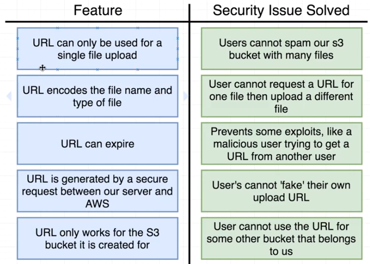
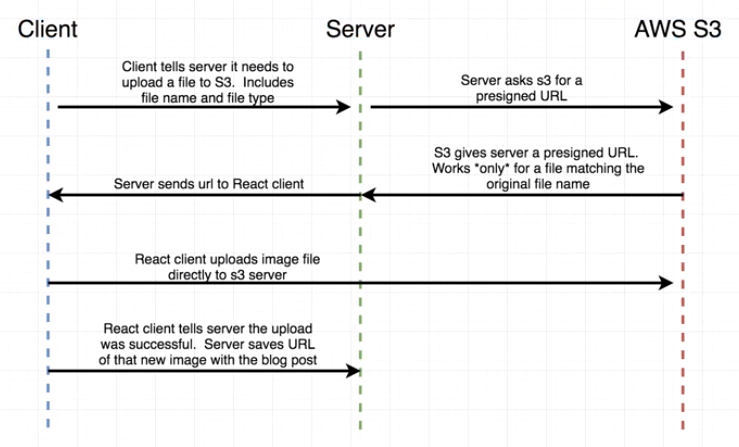

# AWS S3 Upload API

Projeto simples para aplicar técnica de upload direto ao serviço de Cloud utilizando presigned URL

Esta abordagem evita consumo desnecessário de processamento da API para upload da imagem, a imagem irá ser "upada" direto ao storage em nuvem pelo client.

## Vantagens de utilizar "presigned URL's"

## Exemplo de fluxo de upload

